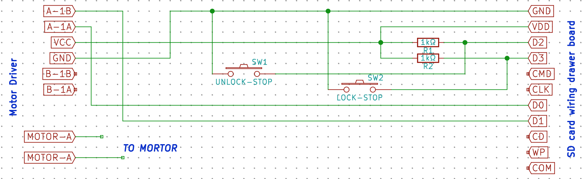
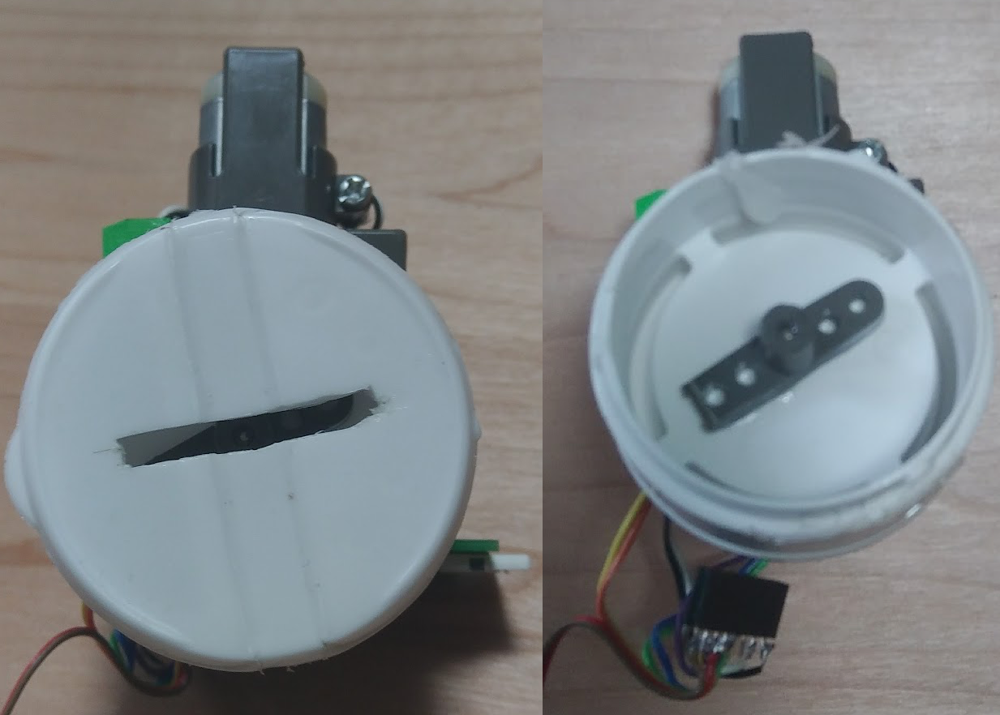
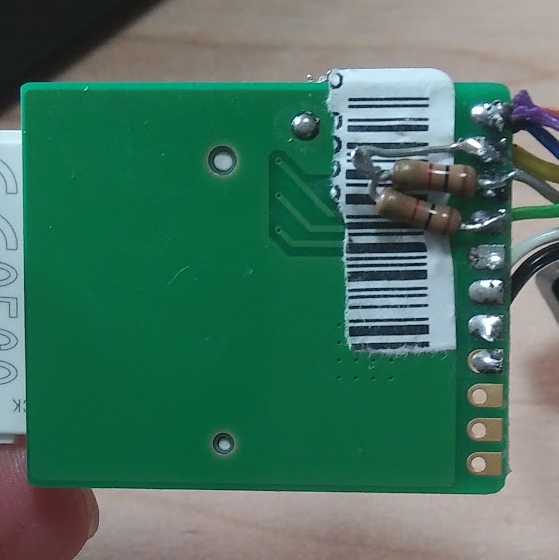
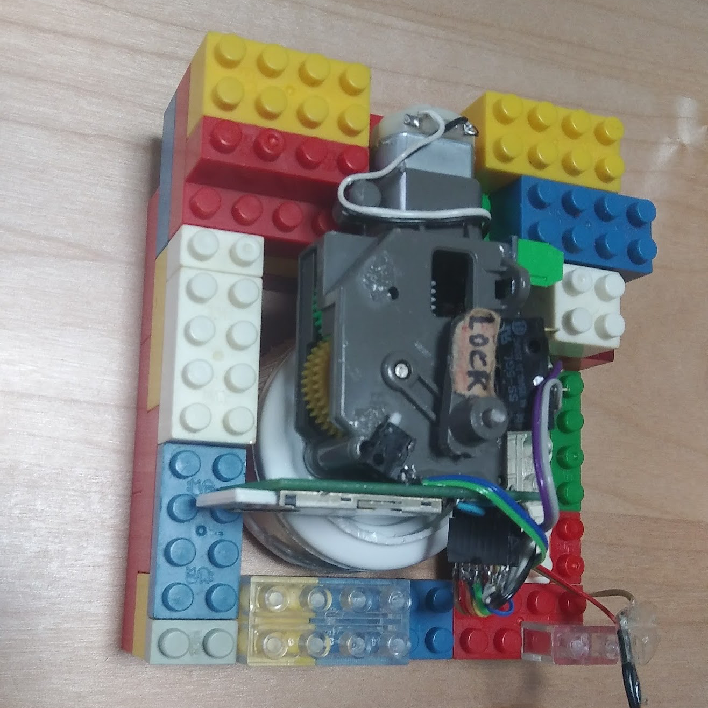

# flashair_house_key
Get electronic home key with the TOSHIBA FlashAir.

## Movie

## How to make
### Requires
* FlashAir http://amzn.to/2sFp9U0
* ＳＤcard wiring drawer board http://akizukidenshi.com/catalog/g/gK-10967/
* HiLetgo L9110S Motor Drive Module http://amzn.to/2t4jIx3
* Metal film resistors 1kΩ x2 http://amzn.to/2u3uAzz
* 3-terminal regulator AZ1086H-3.3 http://akizukidenshi.com/catalog/g/gI-02502/
* Gear box set http://amzn.to/2tyLTYB
* Limit switch http://amzn.to/2u2WqM6
* sesame faucet http://amzn.to/2t432Wv

Optional
* Electrical leads http://amzn.to/2u2LkH1
* Hot-melt http://amzn.to/2t3KIg4
* LEGO or Kawada Block http://amzn.to/2sFAgwa
* MicroUSB Cable http://amzn.to/2ty0GCE
* USB Charger(more than 2.0A) http://amzn.to/2tycm8p

### Cirkit diagram

### Report
 \
Shaft fixed in sesame faucet. \
 \
Swap regulator \
 \
Wiring \
 \
Pull up wiring \
 \
Build block \
 \
Done